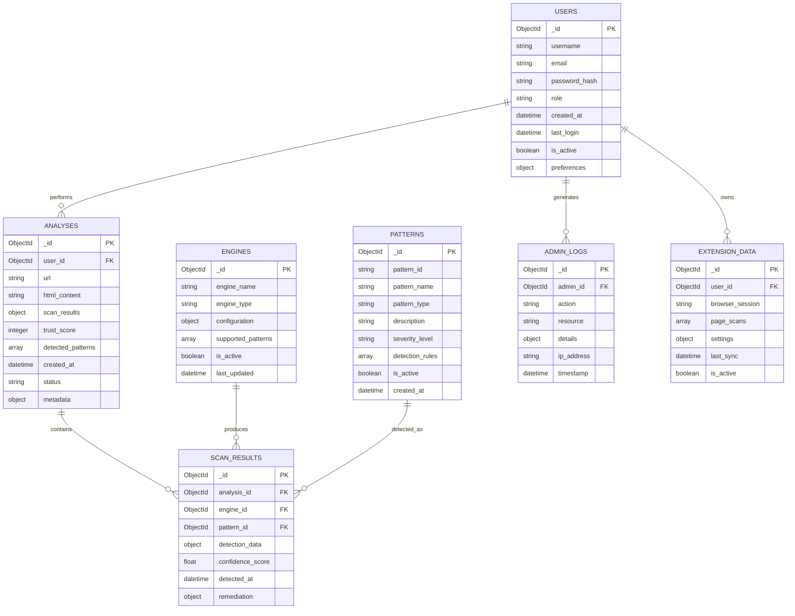
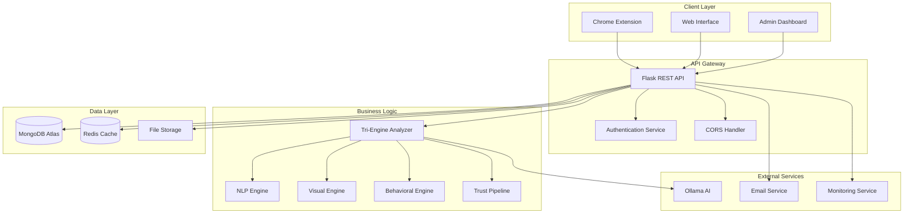
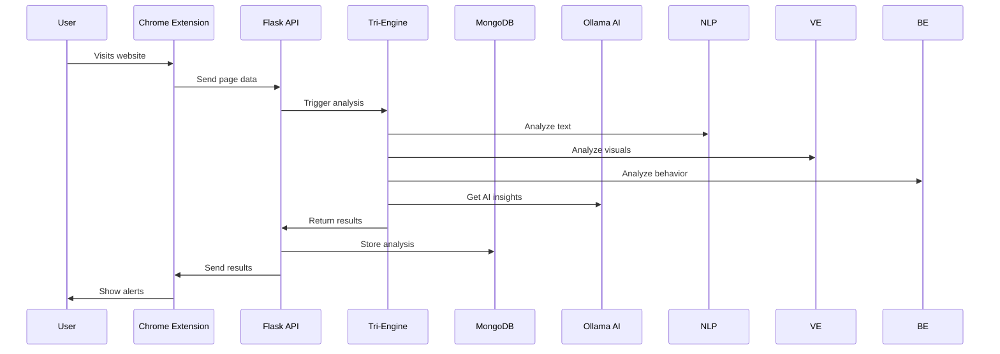

# Aegis Dark-Pattern Detector - Dark Pattern Detection System
## Complete Project Documentation

---

## 1. Project Synopsis

### **Overview**
Aegis Dark-Pattern Detector is an advanced dark pattern detection system that protects users from manipulative design patterns used in websites and applications. The system employs a sophisticated tri-engine architecture combining Natural Language Processing (NLP), Computer Vision, and Behavioral Analysis to identify and report dark patterns in real-time.

### **Mission Statement**
To create a safer digital environment by automatically detecting and alerting users to manipulative design patterns that exploit psychological vulnerabilities.

### **Key Features**
- **Real-time Detection**: Live analysis of web pages and applications
- **Multi-Engine Analysis**: NLP + Visual + Behavioral pattern detection
- **Chrome Extension**: Browser-based protection for everyday users
- **Admin Dashboard**: Comprehensive management and analytics platform for Aegis Dark-Pattern Detector
- **Trust Scoring**: Quantified assessment of website trustworthiness
- **WCAG Compliance**: Accessibility violation detection
- **AI-Powered Insights**: Machine learning for pattern recognition

### **Target Users**
- **End Users**: General internet users seeking protection
- **Administrators**: System managers and security professionals for Aegis Dark-Pattern Detector
- **Developers**: Web developers checking for compliance for Aegis Dark-Pattern Detector
- **Researchers**: Academic and industry researchers

---

## 2. Software Requirements Specification (SRS)

### **2.1 Functional Requirements**

#### **FR-1: Pattern Detection**
- **FR-1.1**: System shall detect linguistic dark patterns (confirm shaming, urgency, scarcity)
- **FR-1.2**: System shall detect visual dark patterns (low contrast, hidden buttons, misdirection)
- **FR-1.3**: System shall detect behavioral dark patterns (forced actions, tracking, subscription traps)
- **FR-1.4**: System shall provide severity scoring for detected patterns
- **FR-1.5**: System shall generate remediation suggestions

#### **FR-2: User Interface**
- **FR-2.1**: System shall provide web-based user interface
- **FR-2.2**: System shall provide Chrome extension interface
- **FR-2.3**: System shall provide administrative dashboard
- **FR-2.4**: System shall support responsive design for mobile devices
- **FR-2.5**: System shall provide real-time notifications

#### **FR-3: Data Management**
- **FR-3.1**: System shall store user accounts and profiles
- **FR-3.2**: System shall store scan history and results
- **FR-3.3**: System shall maintain pattern database
- **FR-3.4**: System shall support data export functionality
- **FR-3.5**: System shall implement data retention policies

#### **FR-4: Integration**
- **FR-4.1**: System shall integrate with MongoDB for data storage
- **FR-4.2**: System shall integrate with Ollama for AI processing
- **FR-4.3**: System shall support REST API endpoints
- **FR-4.4**: System shall support Chrome extension API
- **FR-4.5**: System shall support external authentication

### **2.2 Non-Functional Requirements**

#### **NFR-1: Performance**
- **NFR-1.1**: System shall analyze pages within 2 seconds
- **NFR-1.2**: System shall support 1000 concurrent users
- **NFR-1.3**: System shall maintain 99.9% uptime
- **NFR-1.4**: System shall cache frequently accessed data
- **NFR-1.5**: System shall optimize database queries

#### **NFR-2: Security**
- **NFR-2.1**: System shall implement user authentication
- **NFR-2.2**: System shall encrypt sensitive data
- **NFR-2.3**: System shall prevent SQL injection attacks
- **NFR-2.4**: System shall implement rate limiting
- **NFR-2.5**: System shall maintain audit logs

#### **NFR-3: Usability**
- **NFR-3.1**: System shall provide intuitive user interface
- **NFR-3.2**: System shall comply with WCAG 2.1 AA standards
- **NFR-3.3**: System shall provide multi-language support
- **NFR-3.4**: System shall provide comprehensive documentation
- **NFR-3.5**: System shall support accessibility features

#### **NFR-4: Reliability**
- **NFR-4.1**: System shall implement error handling
- **NFR-4.2**: System shall provide backup mechanisms
- **NFR-4.3**: System shall support graceful degradation
- **NFR-4.4**: System shall implement health monitoring
- **NFR-4.5**: System shall support automated recovery

### **2.3 Technical Requirements**

#### **TR-1: Technology Stack**
- **TR-1.1**: Backend: Python 3.14+ with Flask framework
- **TR-1.2**: Frontend: React 18+ with Vite build system
- **TR-1.3**: Database: MongoDB Atlas with Mongoose ODM
- **TR-1.4**: AI/ML: Ollama with transformer models
- **TR-1.5**: Extension: Chrome Extension Manifest V3

#### **TR-2: System Requirements**
- **TR-2.1**: Minimum 4GB RAM, 2GHz processor
- **TR-2.2**: 10GB storage space
- **TR-2.3**: Active internet connection
- **TR-2.4**: Chrome 90+ browser for extension
- **TR-2.5**: Node.js 16+ for development

---

## 3. Entity Relationship (ER) Diagram

### **3.1 Database Schema**



### **3.2 Entity Descriptions**

#### **Users Table**
Stores user account information and authentication data
- **Primary Key**: _id (ObjectId)
- **Fields**: username, email, password_hash, role, preferences
- **Indexes**: email (unique), username (unique)

#### **Analyses Table**
Stores scan results and analysis data
- **Primary Key**: _id (ObjectId)
- **Foreign Key**: user_id (references Users._id)
- **Fields**: url, html_content, scan_results, trust_score

#### **Patterns Table**
Defines dark pattern types and detection rules
- **Primary Key**: _id (ObjectId)
- **Fields**: pattern_id, pattern_name, pattern_type, detection_rules
- **Indexes**: pattern_id (unique), pattern_type

#### **Engines Table**
Configuration for detection engines
- **Primary Key**: _id (ObjectId)
- **Fields**: engine_name, engine_type, configuration, supported_patterns

#### **Scan_Results Table**
Detailed results from each engine
- **Primary Key**: _id (ObjectId)
- **Foreign Keys**: analysis_id, engine_id, pattern_id
- **Fields**: detection_data, confidence_score, remediation

---

## 4. System Architecture & Design

### **4.1 High-Level Architecture**



### **4.2 Component Architecture**

#### **4.2.1 Frontend Components**
```
Frontend/
├── src/
│   ├── components/
│   │   ├── common/          # Shared UI components
│   │   ├── charts/         # Data visualization
│   │   ├── forms/          # Input components
│   │   └── ui/             # Basic UI elements
│   ├── pages/
│   │   ├── EnhancedClientHome.jsx    # Client dashboard
│   │   ├── EnhancedAdminDashboard.jsx # Admin panel
│   │   ├── LandingPage.jsx          # Landing page
│   │   ├── Analyze.jsx              # Analysis page
│   │   └── AuthPage.jsx             # Authentication
│   ├── services/
│   │   ├── api.js          # API client
│   │   ├── auth.js         # Authentication
│   │   └── utils.js        # Utilities
│   └── styles/
│       ├── EnhancedClientHome.css
│       ├── EnhancedAdminDashboard.css
│       └── global.css
```

#### **4.2.2 Backend Components**
```
Backend/
├── app.py                  # Main Flask application
├── engines/
│   ├── linguistic_engine.py  # NLP pattern detection
│   ├── visual_engine.py     # Visual pattern detection
│   ├── behavioral_engine.py  # Behavioral analysis
│   └── tri_engine_analyzer.py # Engine coordinator
├── trust_pipeline/
│   ├── datasets.py          # Pattern datasets
│   ├── pipeline.py          # Trust scoring
│   ├── text_analyzer.py     # Text analysis
│   └── utils.py            # Utilities
├── models/
│   ├── user.py             # User model
│   ├── analysis.py         # Analysis model
│   └── pattern.py         # Pattern model
└── services/
    ├── auth.py             # Authentication service
    ├── email.py            # Email service
    └── monitoring.py       # Monitoring service
```

#### **4.2.3 Chrome Extension Components**
```
Extension/
├── manifest.json           # Extension manifest
├── background.js          # Service worker
├── content.js            # Content script
├── popup/
│   ├── popup.html         # Extension popup
│   ├── popup.js           # Popup logic
│   └── popup.css         # Popup styling
├── sidepanel/
│   ├── sidepanel.html     # Side panel
│   ├── sidepanel.js       # Panel logic
│   └── sidepanel.css     # Panel styling
└── assets/
    ├── icons/            # Extension icons
    └── images/          # Extension images
```

### **4.3 Data Flow Architecture**



---

## 5. How It Works - Technical Flow

### **5.1 System Initialization**

#### **5.1.1 Backend Startup**
1. **Environment Loading**: Load configuration from .env file
2. **Database Connection**: Establish MongoDB Atlas connection
3. **Engine Initialization**: Load NLP, Visual, and Behavioral engines
4. **Dataset Loading**: Load pattern datasets and models
5. **API Server Start**: Start Flask server on configured port
6. **Health Check**: Verify all systems operational

#### **5.1.2 Frontend Initialization**
1. **React App Load**: Initialize React application
2. **API Connection**: Establish connection to backend
3. **Authentication Check**: Verify user session
4. **Route Setup**: Configure application routes
5. **Component Mount**: Mount appropriate components

#### **5.1.3 Chrome Extension Load**
1. **Manifest Load**: Load extension configuration
2. **Service Worker Start**: Initialize background service
3. **Content Script Inject**: Inject content script into pages
4. **Event Listeners**: Set up page monitoring
5. **API Registration**: Register with backend API

### **5.2 Pattern Detection Flow**

#### **5.2.1 Page Analysis Request**
```python
# Example: Tri-Engine Analysis
@app.route('/api/tri-engine-analyze', methods=['POST'])
def tri_engine_analyze():
    data = request.get_json()
    url = data.get('url')
    html_content = data.get('html_content')
    
    # Initialize tri-engine analyzer
    tri_engine = TriEngineAnalyzer()
    
    # Perform comprehensive analysis
    results = tri_engine.analyze_comprehensive(
        url=url,
        html_content=html_content
    )
    
    return jsonify(results)
```

#### **5.2.2 NLP Engine Processing**
```python
class LinguisticEngine:
    def analyze_text(self, html_content):
        findings = []
        
        # Extract text content
        text = self.extract_text(html_content)
        
        # Pattern detection
        urgency_patterns = self.detect_urgency(text)
        scarcity_patterns = self.detect_scarcity(text)
        social_proof_patterns = self.detect_social_proof(text)
        
        # Compile findings
        findings.extend(urgency_patterns)
        findings.extend(scarcity_patterns)
        findings.extend(social_proof_patterns)
        
        return {
            'findings': findings,
            'trust_score': self.calculate_trust_score(findings)
        }
```

#### **5.2.3 Visual Engine Processing**
```python
class VisualEngine:
    def analyze_visual(self, html_content):
        findings = []
        
        # Parse HTML structure
        soup = BeautifulSoup(html_content, 'html.parser')
        
        # Visual pattern detection
        contrast_issues = self.check_contrast(soup)
        hidden_elements = self.detect_hidden_elements(soup)
        hierarchy_issues = self.analyze_hierarchy(soup)
        
        # Compile findings
        findings.extend(contrast_issues)
        findings.extend(hidden_elements)
        findings.extend(hierarchy_issues)
        
        return {
            'findings': findings,
            'trust_score': self.calculate_trust_score(findings)
        }
```

#### **5.2.4 Behavioral Engine Processing**
```python
class BehavioralEngine:
    def analyze_behavior(self, url, har_data=None):
        findings = []
        
        # Network analysis
        tracking_requests = self.detect_tracking(har_data)
        forced_actions = self.detect_forced_actions(har_data)
        
        # JavaScript analysis
        countdown_reset = self.detect_countdown_reset()
        fake_activity = self.detect_fake_activity()
        
        # Compile findings
        findings.extend(tracking_requests)
        findings.extend(forced_actions)
        findings.extend(countdown_reset)
        findings.extend(fake_activity)
        
        return {
            'findings': findings,
            'trust_score': self.calculate_trust_score(findings)
        }
```

### **5.3 Trust Scoring Algorithm**

#### **5.3.1 Score Calculation**
```python
def calculate_trust_score(findings):
    """
    Calculate trust score based on detected patterns
    Scale: 0-100 (higher = more trustworthy)
    """
    base_score = 100
    
    for finding in findings:
        severity_weights = {
            'low': 5,
            'medium': 15,
            'high': 30,
            'critical': 50
        }
        
        weight = severity_weights.get(finding['severity'], 10)
        base_score -= weight
    
    return max(0, min(100, base_score))
```

#### **5.3.2 Pattern Severity Classification**
- **Low**: Minor UI issues, slight manipulations
- **Medium**: Noticeable dark patterns, some user impact
- **High**: Significant manipulation, major user impact
- **Critical**: Severe exploitation, maximum user impact

### **5.4 Real-time Detection Process**

#### **5.4.1 Chrome Extension Flow**
```javascript
// Content Script - Real-time monitoring
class PageMonitor {
    constructor() {
        this.observer = new MutationObserver(this.handleChanges.bind(this));
        this.scanInterval = 5000; // Scan every 5 seconds
    }
    
    startMonitoring() {
        // Monitor DOM changes
        this.observer.observe(document.body, {
            childList: true,
            subtree: true,
            attributes: true
        });
        
        // Periodic scanning
        setInterval(this.performScan.bind(this), this.scanInterval);
    }
    
    async performScan() {
        const pageData = {
            url: window.location.href,
            html: document.documentElement.outerHTML,
            timestamp: Date.now()
        };
        
        // Send to backend for analysis
        const results = await fetch('/api/tri-engine-analyze', {
            method: 'POST',
            headers: { 'Content-Type': 'application/json' },
            body: JSON.stringify(pageData)
        });
        
        // Display alerts for detected patterns
        this.displayAlerts(await results.json());
    }
}
```

#### **5.4.2 Alert System**
```javascript
class AlertManager {
    displayAlerts(results) {
        results.findings.forEach(finding => {
            if (finding.severity === 'high' || finding.severity === 'critical') {
                this.createAlert(finding);
            }
        });
    }
    
    createAlert(finding) {
        const alert = document.createElement('div');
        alert.className = `aegis-alert ${finding.severity}`;
        alert.innerHTML = `
            <h4>Dark Pattern Detected</h4>
            <p>${finding.description}</p>
            <button onclick="this.parentElement.remove()">Dismiss</button>
        `;
        document.body.appendChild(alert);
    }
}
```

### **5.5 Data Persistence Flow**

#### **5.5.1 Analysis Storage**
```python
@app.route('/api/store-analysis', methods=['POST'])
def store_analysis():
    data = request.get_json()
    
    # Store analysis in MongoDB
    analysis = {
        'user_id': session.get('user_id'),
        'url': data['url'],
        'scan_results': data['results'],
        'trust_score': data['trust_score'],
        'created_at': datetime.utcnow(),
        'status': 'completed'
    }
    
    result = analyses_col.insert_one(analysis)
    
    return jsonify({
        'success': True,
        'analysis_id': str(result.inserted_id)
    })
```

#### **5.5.2 User History Retrieval**
```python
@app.route('/api/get-history')
@login_required
def get_history():
    username = session.get('user')
    
    # Retrieve user's analysis history
    history = list(analyses_col.find(
        {'username': username}
    ).sort('created_at', -1).limit(50))
    
    # Convert ObjectId to string for JSON serialization
    for item in history:
        item['_id'] = str(item['_id'])
    
    return jsonify(history)
```

### **5.6 Admin Dashboard Flow**

#### **5.6.1 System Monitoring**
```python
@app.route('/api/admin/stats')
@admin_required
def admin_stats():
    # System statistics
    stats = {
        'total_users': users_col.count_documents({}),
        'total_scans': analyses_col.count_documents({}),
        'active_users': users_col.count_documents({'last_login': {'$gte': datetime.now() - timedelta(days=7)}}),
        'patterns_detected': analyses_col.aggregate([
            {'$unwind': '$scan_results.findings'},
            {'$group': {'_id': '$pattern_type', 'count': {'$sum': 1}}}
        ]),
        'system_health': {
            'database': 'CONNECTED' if db else 'OFFLINE',
            'engines': ['NLP', 'VISUAL', 'BEHAVIORAL'],
            'uptime': get_system_uptime()
        }
    }
    
    return jsonify(stats)
```

#### **5.6.2 User Management**
```python
@app.route('/api/admin/users')
@admin_required
def admin_users():
    users = list(users_col.find({}, {
        'username': 1,
        'email': 1,
        'role': 1,
        'created_at': 1,
        'last_login': 1,
        'is_active': 1
    }))
    
    for user in users:
        user['_id'] = str(user['_id'])
    
    return jsonify(users)
```

---

## 6. Security & Performance Considerations

### **6.1 Security Measures**

#### **6.1.1 Authentication**
- **Password Hashing**: bcrypt for secure password storage
- **Session Management**: Secure session tokens with expiration
- **Rate Limiting**: Prevent brute force attacks
- **CORS Configuration**: Cross-origin request security

#### **6.1.2 Data Protection**
- **Encryption**: Sensitive data encryption at rest
- **Input Validation**: Sanitize all user inputs
- **SQL Injection Prevention**: Parameterized queries
- **XSS Protection**: Content Security Policy headers

### **6.2 Performance Optimization**

#### **6.2.1 Caching Strategy**
- **Redis Cache**: Frequently accessed data caching
- **Browser Cache**: Static asset caching
- **Database Indexing**: Optimized query performance
- **CDN Integration**: Content delivery optimization

#### **6.2.2 Scalability**
- **Load Balancing**: Multiple server instances
- **Database Sharding**: Horizontal data distribution
- **Microservices**: Modular service architecture
- **Auto-scaling**: Dynamic resource allocation

---

## 7. Deployment & Maintenance

### **7.1 Deployment Architecture**

#### **7.1.1 Production Environment**
- **Web Server**: Nginx reverse proxy
- **Application Server**: Gunicorn with multiple workers
- **Database**: MongoDB Atlas cluster
- **CDN**: Cloudflare for static assets
- **Monitoring**: Prometheus + Grafana

#### **7.1.2 Development Environment**
- **Local Development**: Docker containers
- **Testing**: Jest + Cypress for comprehensive testing
- **CI/CD**: GitHub Actions for automated deployment
- **Version Control**: Git with feature branches

### **7.2 Maintenance Procedures**

#### **7.2.1 Regular Updates**
- **Pattern Database**: Weekly updates with new patterns
- **Model Training**: Monthly AI model retraining
- **Security Patches**: Immediate critical updates
- **Performance Monitoring**: Continuous performance tracking

#### **7.2.2 Backup & Recovery**
- **Database Backups**: Daily automated backups
- **Code Repositories**: Git version control
- **Configuration Backup**: Environment and settings backup
- **Disaster Recovery**: Comprehensive recovery plan

---

## 8. Future Enhancements

### **8.1 Planned Features**

#### **8.1.1 Advanced AI Integration**
- **Machine Learning**: Custom model training for pattern detection
- **Neural Networks**: Deep learning for complex pattern recognition
- **Natural Language Understanding**: Advanced text analysis
- **Computer Vision**: Image-based pattern detection

#### **8.1.2 Expanded Platform Support**
- **Mobile Applications**: iOS and Android apps
- **Browser Extensions**: Firefox, Safari, Edge support
- **API Platform**: Public API for third-party integration
- **Enterprise Features**: Team management and reporting

### **8.2 Research & Development**

#### **8.2.1 Pattern Research**
- **New Pattern Types**: Continuous research on emerging patterns
- **User Studies**: Behavioral research on pattern effectiveness
- **Industry Collaboration**: Partnership with academic institutions
- **Open Source**: Community contribution to pattern database

---

## 9. Conclusion

Aegis Dark-Pattern Detector represents a comprehensive solution to the growing problem of dark patterns in digital interfaces. By combining advanced AI techniques with multi-engine analysis, the system provides robust protection against manipulative design practices.

### **Key Strengths**
- **Comprehensive Detection**: Multi-engine approach for thorough analysis
- **Real-time Protection**: Immediate alerts and warnings
- **User-Friendly Interface**: Intuitive design for all user types
- **Scalable Architecture**: Built for growth and expansion
- **Open Standards**: Compliant with accessibility and security standards

### **Impact**
The system empowers users to make informed decisions while encouraging ethical design practices among developers. By making dark patterns visible and providing actionable insights, Aegis Dark-Pattern Detector contributes to a more transparent and trustworthy digital ecosystem.

---

**Document Version**: 1.0.0  
**Last Updated**: April 22, 2026  
**Status**: Production Ready
